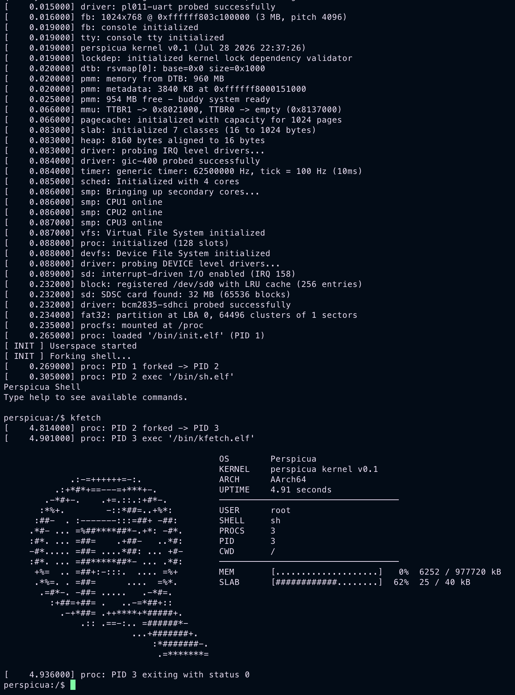

# Perspicua


-4a5568?style=flat-square)


Perspicua is a 64-bit, multi-core, UNIX-like operating system kernel for the
Raspberry Pi 4B (BCM2711, Cortex-A72), written for AArch64.

It boots at EL1 with the MMU enabled, runs a round-robin scheduler across
per-core runqueues, mounts a FAT32 root filesystem from the SD card through a
VFS layer, and execs an ELF init process into userspace. Development happens
against QEMU's `raspi4b` machine; changes are validated on real hardware before
release.

<p align="center">
  
  <br>
  <sub>Booting to the shell under QEMU (<code>just run</code>)</sub>
</p>

## Status

This describes what exists today. For planned work see
[`docs/order.txt`](docs/order.txt) and [`docs/ideas.txt`](docs/ideas.txt).

**Architecture and boot**
- AArch64 (Cortex-A72), 4 cores via SMP
- Flattened-devicetree (FDT) parsing at boot
- Secondary cores released from the spin table

**Memory**
- Physical page allocator (4KB pages)
- 39-bit virtual address spaces, kernel high-half plus per-process user map
- Copy-on-write faults
- Slab and heap allocators; ASID pool

**Processes and scheduling**
- Per-core runqueues, round-robin selection; sleep and wait queues
- `fork`, `exec` (ELF loader), `exit`, `waitpid`
- Per-process address space, file-descriptor table, and signal state
- POSIX-style signals; job-control stops are not fully wired yet

**Filesystems**
- VFS core with an ops table per node and path resolution through mounts
- FAT32 (on-disk root), devfs, procfs, ramfs, pipes
- Page cache for file data; block cache in the sd/block drivers
- Writeback daemon

**Drivers**
- UART, GIC, GPIO, mailbox, SD card and block layer
- Framebuffer: `fb` → `graphics` → `fb_console` (8x8 font) → `dashboard`
- Devicetree-driven device and probe model

**User/kernel interface**
- 37 syscalls defined in [`uapi/syscalls.h`](uapi/syscalls.h)
- `uaccess` helpers copy across the boundary with fault fixup, so a bad user
  pointer returns an error rather than faulting the kernel
- In-tree freestanding libc shared by kernel and userspace
- Userspace: `init`, `sh`, `ls`, `cat`, `hd`, `ptop`, `kfetch`, and test programs

**Debugging**
- In-kernel debugger (kdb), lockdep, KASAN
- Generated symbol tables and GDB helper scripts

## Boot sequence

The primary core enters through `kernel/arch/boot.S`, then calls `main()` in
`kernel/init/main.c`. Stages run in order, because each depends on the ones
before it:

| Stage | Brings up |
|---|---|
| 0 | Devicetree — parse the DTB so later stages can discover memory, CPUs, devices |
| 1 | Console — probe core drivers, framebuffer and text console, tty |
| 2 | Memory — reserve regions, pmm, enable MMU, ASID pool, page cache, rebase DTB, kernel heap |
| 3 | Interrupts and scheduling — IRQ-driven drivers, UART IRQs, timer tick, scheduler |
| 4 | SMP and filesystems — wake secondary cores, VFS, processes, devfs, mount FAT32 at `/`, writeback, procfs |

The kernel then enables interrupts, optionally runs the test suites under
`CONFIG_TESTS`, and execs `/bin/init.elf`. The boot thread parks in a `wfe`
loop; the scheduler runs everything from that point.

Full detail is in [`docs/architecture.txt`](docs/architecture.txt).

## Building

Requires an AArch64 cross-compiler, CMake, [just](https://github.com/casey/just),
mtools, and cpio.

```
just build [type]   Build the project (default: debug)
just run            Compile and run in QEMU
just run-gui        Run in QEMU with GUI (serial vc)
just debug          Compile and start in debug mode (waits for GDB)
just gdb            Connect GDB to the QEMU debug instance
just disasm         Show disassembled kernel
just clean          Remove build artifacts
```

Examples:

```sh
just build            # builds Debug
just build release    # builds Release (optimized)
```

The output image is `pi4-boot/kernel8.img`.

## Testing

In-kernel test suites live in `kernel/tests/` and are compiled in only under
`CONFIG_TESTS`: pmm, mmu, mmu_user, slab, heap, kasan, spinlock, mutex, sched,
process, signals, pipe, vfs, fat32, sd, uaccess, timer, string, and types.
`scripts/run_tests.sh` runs them headlessly. See
[`docs/testing.txt`](docs/testing.txt).

## Source tree

```
kernel/     arch/ core/ mm/ sched/ fs/ driver/ devicetree/ init/ tests/ include/
libc/       freestanding C library (kernel/, user/, src/, arch/, include/)
uapi/       user/kernel ABI: syscall numbers, error codes, struct layouts
user/       crt0.S and userspace applications
cmake/      cross-compilation toolchain file
scripts/    symbol-table generation, GDB helpers, test harness
pi4-boot/   firmware, devicetree blob, and the final kernel8.img
docs/       design and process documentation
```

## Documentation

- [`docs/architecture.txt`](docs/architecture.txt) — how the system fits together
- [`docs/testing.txt`](docs/testing.txt) — the test harness
- [`docs/coding_style_guidelines.txt`](docs/coding_style_guidelines.txt) — house style
- [`docs/branch_workflow.txt`](docs/branch_workflow.txt) — branch workflow
- [`CONTRIBUTING.txt`](CONTRIBUTING.txt) — making a change end to end

## License

MIT. See [`LICENSE`](LICENSE).
